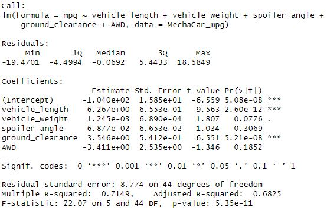
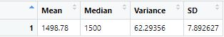
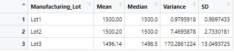
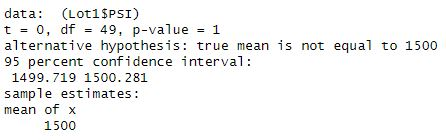
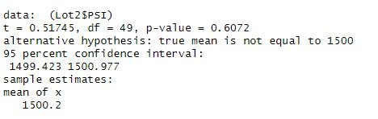
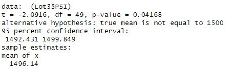

# MechaCar_Statistical_Analysis

## Summary
In this analysis, we analyzed two different dataframes using R. The MechaCars_mpg dataframe contained 50 rows with information about each vehicle such as the vehicle's length, weight, spoiler angle, ground clearance, AWD, and mpg. The Suspension_Coil dataframe contained information regarding vehicles' tire PSI. Each vehicle in this dataframe had a vehicle ID and a manufacturing lot in addition to the PSI. 

## Linear Regression to Predict MPG.
In our linear regression of the MechaCars_mpg dataframe, we found that of the variables displayed multiple levels of variance relating to the mpg.

In order from least variance to most variance:
- vehicle_length Std. Error 6.890e-04
- spoiler_angle Std. Error 6.653e-02
- ground_clearance Std. Error 5.412e-01
- vehicle_length Std. Error 6.553e-01
- AWD Std. Error 2.535e0

With lower standard errors displaying a higher non-random variance to mpg, the vehicle's length, spoiler angle, and ground clearance would more greatly influence the vehicle's mpg. 

The slope of this linear regression is not considered to be zero because each regression line has a correlation to mpg.

For the variables that have a non-random variance to mpg, this regression would be a good tool to predict mpg of MechaCar prototypes. With a p-value of 5.35e-11, the lines of best fit are very accurate in the model. 

## Summary Statistics on Suspension Coils
We created some summary statistics for MechaCar's Suspension Coils. This dataframe compared different manufacturing lots, vehicle id's, and their PSIs. 

MechaCar's design specifications state that the suspension coil's variance must not exceed 100 PSI. The current manufacturing data does meet design specifications for all lots, however Lot 3 does not meet specifications when measuring each individual lot. 

For all lots, the suspension coil PSI variance is 62.29 PSI.

For the individual lots, Lot 1 and 2 are under 100 PSI variance, however Lot 3 sits at 170.28 PSI variance.

## T-Tests on Suspension Coils
We performed T-Tests to determine if the average PSI per lot was statistically similar to the average population PSI of 1500. Lots 1 and 2 had  a p-value of less than 1 but greater than 0.1. This p-value rejects the null-hypothesis that suggests there is no statistical similarity between the Lot PSI and the population PSI. Thus, our average PSI is statistically similar to the population's average PSI of 1500 pounds per square inch. However, Lot 3 had a p-value of 0.04168, which supports the null hypothesis, meaning there is a statistical difference between the tested mean of 1496.14 versus the population mean of 1500.

P-Value of 1 for a tested mean of 1500PSI. Statistically similar.

P-Value of 0.6072 for a tested mean of 1500.02. Statistically similar.

P-Value of 0.04168 for a tested mean of 1496.14. Statistically different.

## Study Design: MechaCar vs Competition
In order to better assess MechaCar's product, we can create a short statistical study that compares MechaCar's products to competition. In this statistical study, we will compare MechaCar's cost to our competitiion's cost. We can compare each MechaCar vehicle to the average cost of vehicles of that type in the population. 

Our hypothesis is that MechaCar's vehicles are cheaper than the vehicles in the population. Our null hypothesis is that there is no statistical difference between MechaCar's vehicle cost and other vehicles of that type. An alternative hypothesis is that MechaCar's cost is higher than the population.

We would perform a t-test to determine the similarity between MechaCars and the population. 

For this study, we would need to have a dataframe that lists the vehicle type and cost of that vehicle for each Mechacar vehicle. We would then compare the average price of MechaCar vehicles to a dataset of the average cost of each vehicle type for the population.
